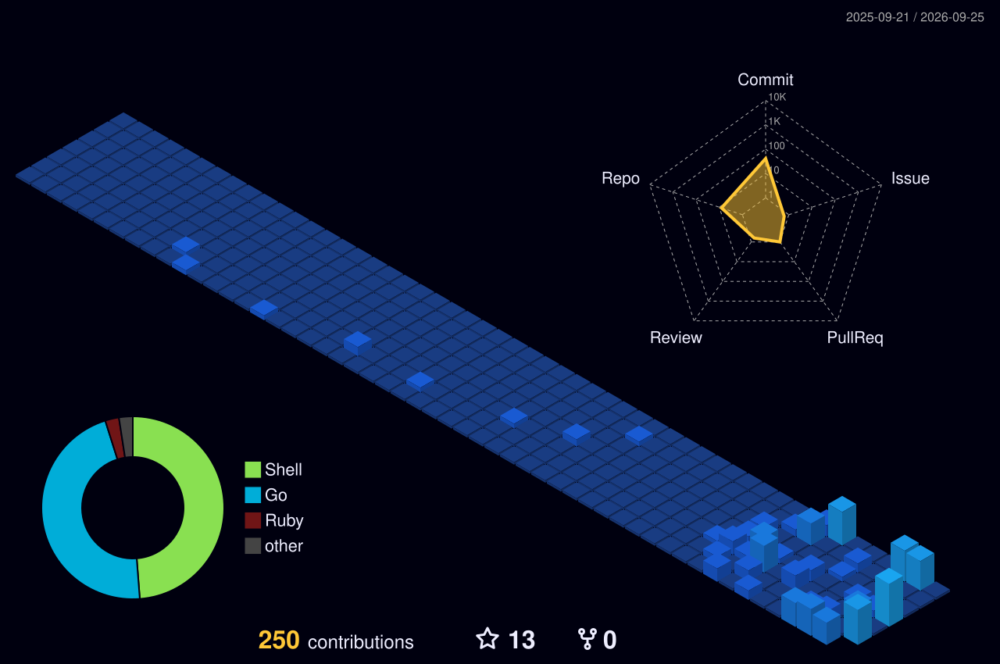
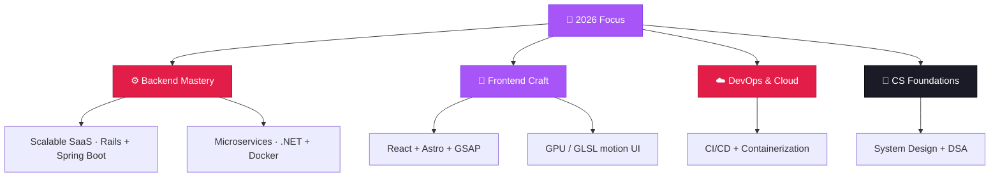

<!-- ═══════════════════════ HEADER ═══════════════════════ -->

<!-- ═══════════════════════ WELCOME + COUNTER ═══════════════════════ -->

<!-- ═══════════════════════ INTRO + CODER GIF ═══════════════════════ -->

## 👋 Hey, I'm Devansh

Thanks for stopping by. I'm a **Full Stack Developer** and consultant at **Infotech.Works**, based in Pune, India. My thing is bridging complex backend systems and intuitive, high-performance frontends — the kind that feel precise and inevitable.

- 🏗️ Currently building scalable SaaS at **Infotech.Works** with Ruby on Rails + React
- 🎓 PG-DAC Certified from **CDAC IACSD**
- ✈️ Exchange student alumni — **Laurentian University, Canada**
- 🌐 Portfolio → **[devansh-sharma-dev-profile.vercel.app](https://devansh-sharma-dev-profile.vercel.app/)**
- 🦊 Also on GitLab → **[@DevanshSharmaT_T](https://gitlab.com/DevanshSharmaT_T)**
- ⚡ Fun fact: certified **Chainsaw Man** fan

  
  
  
  

 

<!-- ═══════════════════════ TECH STACK ═══════════════════════ -->
## 🛠️ Tech I Work With

  
  
  
  
  
  
  
  
  
  
    
  

 

<table>
  <tr><th>Backend</th><th>Frontend</th><th>Infrastructure &amp; Tools</th></tr>
  <tr><td>Java · Spring Boot</td><td>React · Astro</td><td>Docker · Linux</td></tr>
  <tr><td>Ruby on Rails</td><td>TypeScript · JavaScript</td><td>MySQL</td></tr>
  <tr><td>.NET · C#</td><td>Tailwind CSS</td><td>Git · GitHub · GitLab</td></tr>
  <tr><td>C++</td><td>HTML5 · CSS3</td><td>REST APIs</td></tr>
</table>

<!-- ═══════════════════════ PROJECTS ═══════════════════════ -->
## 🚀 Things I've Built

- **[Developer Showcase](https://devansh-sharma-dev-profile.vercel.app/)** — Personal portfolio built with Astro.js, GLSL shaders & GSAP. Sub-100ms interaction time with GPU-accelerated motion.
- **[Nex Events](https://github.com/DevanshSharmaT-T/nex-event.git)** — Full-stack event management platform with real-time booking, multi-backend (.NET + Spring Boot), and Docker containerization.
- **[Team Hive](https://github.com/DevanshSharmaT-T/Team-Hive.git)** — Collaborative team management platform with real-time project tracking and automated workflows.
- **[Shopworks Portal](https://retail-store-three.vercel.app/)** — Retailer operations management system built during my internship at Connected Dot Solutions.

<!-- ═══════════════════════ STATS + MILESTONES ═══════════════════════ -->
## 📊 GitHub Stats

  
  

  

<!-- 🏆 GitHub Milestones — restored once the self-hosted github-profile-trophy Vercel instance is live (canonical instance is over quota / returns 402).
## 🏆 GitHub Milestones

  

-->

<!-- ═══════════════════════ CONTRIBUTION GRAPHS ═══════════════════════ -->
## 📈 Contribution Graphs

  

<!-- 3D contribution graph — generated by .github/workflows/3d-contrib.yml. Appears after the first Action run. -->

  

<!-- Pac-Man contribution graph — generated by .github/workflows/pacman.yml (pushed to the 'output' branch). Appears after the first Action run. -->
<picture>
  <source media="(prefers-color-scheme: dark)" srcset="https://raw.githubusercontent.com/DevanshSharmaT-T/DevanshSharmaT-T/output/pacman-contribution-graph-dark.svg" />
  <source media="(prefers-color-scheme: light)" srcset="https://raw.githubusercontent.com/DevanshSharmaT-T/DevanshSharmaT-T/output/pacman-contribution-graph.svg" />
  
</picture>

<!-- ═══════════════════════ ROADMAP ═══════════════════════ -->
## 🗺️ 2026 Roadmap

<!-- ═══════════════════════ CHAINSAW MAN ═══════════════════════ -->
## ⚡ ...and yeah, a Anime fan

  
   
  <i>Keep the dream simple. Keep building.</i>

<!-- ═══════════════════════ FOOTER ═══════════════════════ -->

